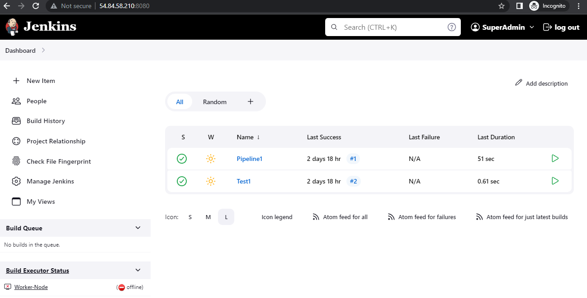
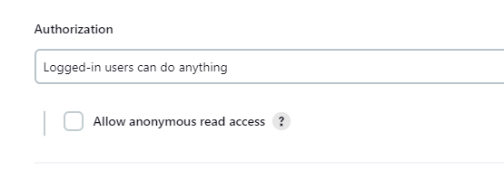
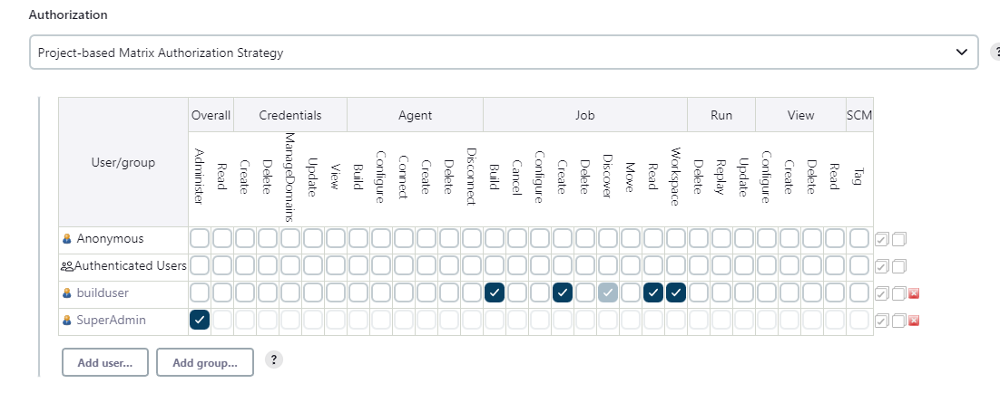
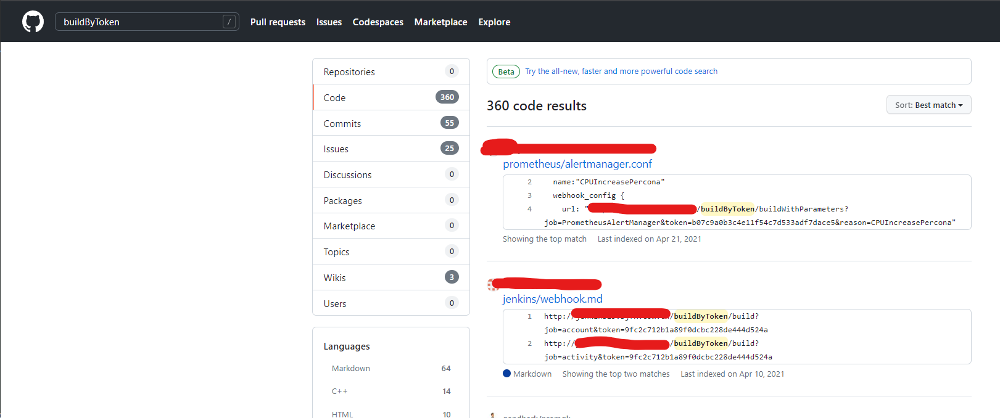

# Jenkins Basics & Misconfigurations

## Terminiologies

- Controllers - The master node. It manages and schedule jobs which are usually carried out by the workers/agents. The interface allows us to administer and control various tasks like managing credentials, jobs, users, plugins, etc. 
- Agents - They are the workers which executes the job requested by the controller. It communicates with the controller via the JNLP protocol. The commmunication is usually encrypted.
- Ephimeral - They are created. They are used. Then they are gone ! No one remembers them ! Usually a secure approach to run agents.

## Jenkins Views


- Think Views like your desk. You can customize what you would like to see on them. 
- Through views you can organize how your jenkins projects and jobs are displayed, their status, their duration,etc.
- We can control what kind of view will be served to the end user based on the privileges.
- There can be views avaiable without any need for authentication.
- Depending upon how views and Jenkins Matrix Authorization is configured, they can provide juicy information.
- **DEMO**

## Jenkins Matrix Authorization Plugin
- By default, every new user has admin rights and the Authorization is set to "Logged-in Users can do anything"


- Jenkins Matrix Authorization Plugin is installed during installation of Jenkins
- Useful to provide granual access to users
- This is where "Security Misconfiguration Magic" happens


## Intersting Endpoints

- Controller Routes
   - Users - http://<host:ip>/asynchPeople/
   - Credentials - http://<host:ip>/credentials/
   - Jobs - http://<host:ip>/job/
- Controller API endpoints
   - XML - http://<host:ip>/api/xml
   - JSON - http://<host:ip>/api/json
- Based on how views are configured or how the authorization matrix is set, the forced browsing can be used to view those endpoints.

## Triggering builds 

- Manually - By clicking the build button

- Via Pull Requests/New Branch - As used in MultiBranch Pipeline, new builds are triggered with new Pull Requests and Branch.

- Via Build Token - When we want to intiate build via API / Automation , for example ```http://server:ip/job/Test1/build?token=BUILDIT```


