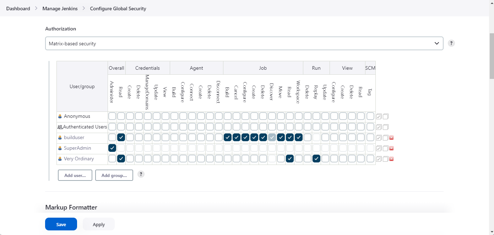
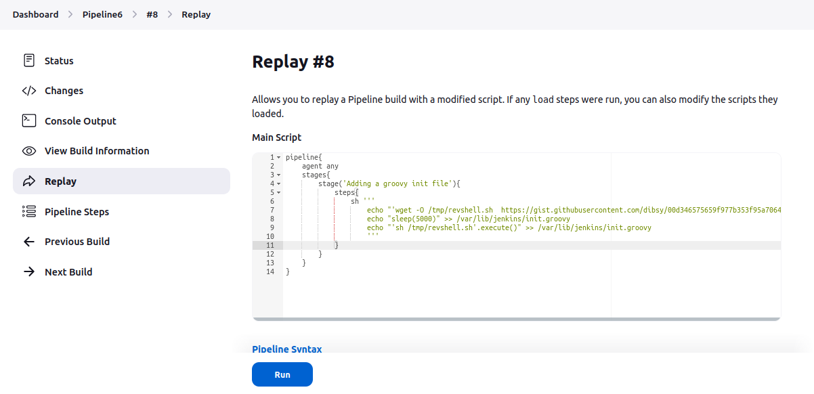

# Pipeline Attacks

## Attacking via a compromised GitHub code
- If we are able to access the SCM ( like GitHub, GitLab, etc), we can look for the Jenkinfile.
- If we have enough privileges( write access available ) , we can modify the Jenkinfile with our own modification.
- Next we wait for the trigger to happen.

## Replaying the pipeline
- Depending on how the permissions are misconfigured, we can run builds without having build permissions!

- Attacking via a PR
- Attacking using a build token

