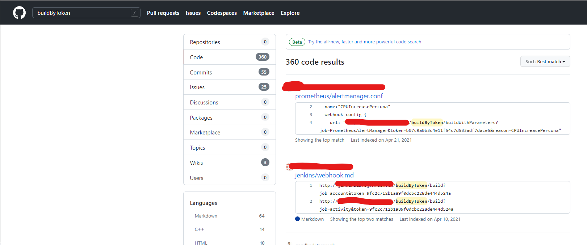

# Pipeline Attacks

## Attacking via a compromised GitHub code
- If we are able to access the SCM ( like GitHub, GitLab, etc), we can look for the Jenkinfile.
- If we have enough privileges( write access available ) , we can modify the Jenkinfile with our own modification.
- Next we wait for the trigger to happen.

## Replaying the pipeline
- Depending on how the permissions are misconfigured, we can run builds without having build permissions!

## Attacking via a Pull Request
- Opensource projects in github/gitlab allows contributors to create a Pull Request
- To determine if the PR is able to be merged or the tests are working correctly, the maintainers configures the Build System to start a new build.
- As an attacker if we can change the Jenkinsfile and the build runs the contents of the modified Jenkinsfile, we can carry out attacks of credential dumping,pivoting,etc

## Attacking using a build token

